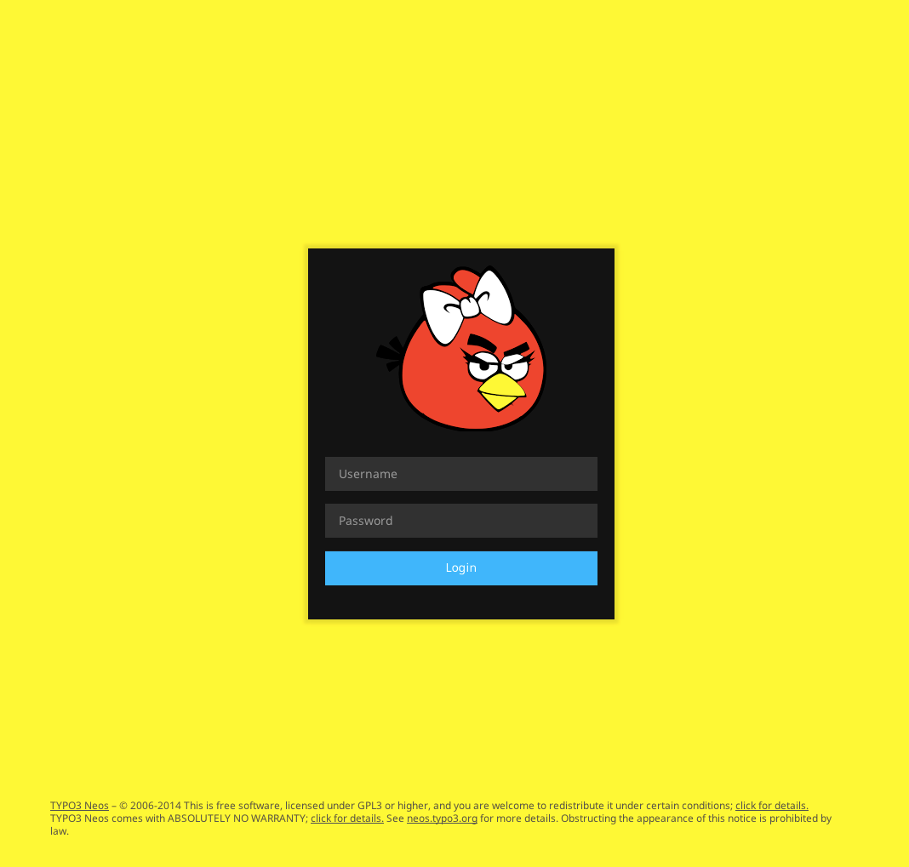

# Custom Neos Login Screen

## How to do it

1. Copy Configuration/Views.yaml into your own package. In here we override the layoutRootPath for the login screen, and point it to our own package
2. Copy the Default.html file to your package and adjust the CSS path and make it look like you wan't it to

## Example

